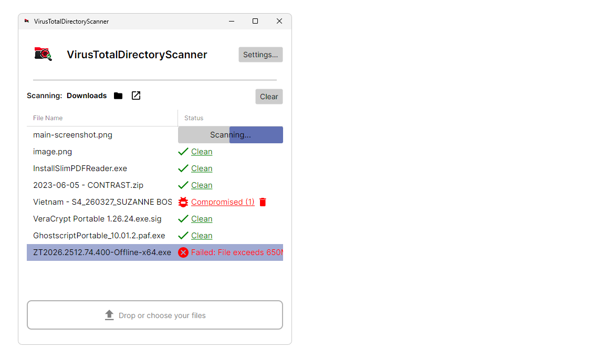

# VirusTotalDirectoryScanner

**Drop files. Get scanned by 70+ antivirus engines. Sleep soundly. 🛡️**



## Why This Exists

Let's be honest: manually uploading files to VirusTotal is *tedious*. But nevertheless, even with antivirus software running on my computer, I'm the kind of person who scans *everything*. Call it paranoid, call it "I've seen what malware can do and I'm not taking any chances."

So I built this. A desktop app that watches a folder (like your Downloads), automatically submits new files to VirusTotal's army of 70+ antivirus engines, and sorts them into "Clean" or "Compromised" folders. No more manual uploads. Just set it and forget it.

## How It Works (The Fun Part)

1. **Pick a folder to scan** — Point the app at any directory (your Downloads folder is the prime suspect here).

2. **Drop files in** — Either let files land in your scan folder naturally, or drag-and-drop them directly into the app's drop zone.

3. **Watch the magic happen** — Each file gets:
   - Its checksum calculated
   - Sent off to VirusTotal for analysis
   - Scanned by 70+ antivirus engines simultaneously

4. **See the results in real-time** — The status column shows you exactly what's happening:
   - 🔵 **Scanning...** — Currently being analyzed
   - ✅ **Clean** — No threats detected. Click to see the full VirusTotal report.
   - 🐛 **Compromised (X)** — Uh oh. X vendors flagged this file. Click for details, or delete it on the spot.
   - ⚠️ **Failed** — Something went wrong (file too large, network issues, etc.)

5. **Files get sorted automatically** — Clean files go to your "Clean" folder. Sketchy files get quarantined in your "Compromised" folder.

6. **Pause anytime** — Click the status text to toggle between scanning and paused. Life happens.

## Quick Setup

1. **Get a VirusTotal API key** — It's free! [Sign up here](https://www.virustotal.com/gui/join-us).

2. **Run the app** and click **Settings**.

3. **Paste your API key** and configure your directories:
   - **Scan Directory**: Where you'll drop files to be scanned
   - **Clean Directory**: Where safe files get moved
   - **Compromised Directory**: The quarantine zone

4. That's it. Start dropping files.

## Features at a Glance

- 🔍 **Real-time directory monitoring** — Watches your folder for new files
- 🚀 **Automatic uploads** — No manual intervention needed
- 📊 **Live status updates** — See exactly what's happening with each file
- 🗂️ **Auto-sorting** — Clean and compromised files go to separate folders
- 🔗 **One-click reports** — Click any result to view the full VirusTotal analysis
- 🗑️ **Quick delete** — One-click to permanently delete compromised files
- ⏸️ **Pause/Resume** — Take a break when you need to
- ⚙️ **Smart rate limiting** — Respects your VirusTotal API quotas automatically
- 🔔 **Windows notifications** — Get alerted when threats are found
- ♿ **Fully accessible** — Keyboard navigation and screen reader support

## Building from Source

### Prerequisites

- [.NET 10.0 SDK](https://dotnet.microsoft.com/)
- A [VirusTotal API Key](https://www.virustotal.com/gui/join-us)

### Clone and Run

```bash
git clone https://github.com/yourusername/VirusTotalDirectoryScanner.git
cd VirusTotalDirectoryScanner
dotnet build
dotnet run --project VirusTotalDirectoryScanner
```

### Run the Tests

```bash
dotnet test
```

## Tech Stack

Built with modern .NET technologies:

- **[.NET 10](https://dotnet.microsoft.com/)** — The runtime
- **[Avalonia UI](https://avaloniaui.net/)** — Cross-platform desktop UI
- **[CommunityToolkit.Mvvm](https://github.com/CommunityToolkit/dotnet)** — MVVM made easy
- **[Refit](https://github.com/reactiveui/refit)** — Type-safe REST client

## License

MIT License — see [LICENSE](LICENSE) for details.

---

*Stay safe out there. Trust no file.* 🔒
